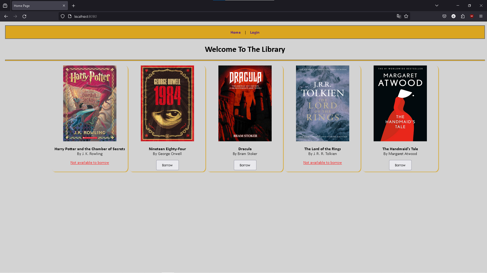

# LIBRARY WEB APPLICATION

#### Video Demo: [link](https://youtu.be/-hRL951KxGo)



#### Description:
This project is a Node.js web application that enables users to borrow books from the library and manage their history. If the user has admin credentials then, they will be able to see all the users and how many books each user has borrowed.


**About the application:**

+ Server created using [Node.js](https://nodejs.org/en)

+ User interfaces implemented with [EJS](https://www.npmjs.com/package/ejs).

+ Databases implemented with [Mongo Atlas](https://www.mongodb.com/atlas/database) and [Mongoose](https://www.mongodb.com/developer/languages/javascript/getting-started-with-mongodb-and-mongoose/).

+ Sessions managed using the [express-sessions](https://www.npmjs.com/package/express-session) library.

+ [Nodemon](https://www.npmjs.com/package/nodemon) used for automating and restarting the live server. (Optional)


## Application features

**For the public users:**

1. User account features (login, logout).

2. View a list of books in the library.

3. Borrow a book.

4. Return a book.

5. History of the books borrowed.


**For the admins:**

1. All the features public users has.

2. View all public user accounts and the number of books borrowed by each user.


## Endpoints

*The application’s user interface consist of the following pages. The page displayed when
the user visits the specified endpoint*


| Page | Endpoint | Description | Accessibility
|--|--|--|--|
| Home | / | Displays all the books in the library | Visible to everyone |
| Login | /login | Displays login form| Visible to everyone |
| History | /history | Displays the books that previously and currently borrowed | Only visible to users |
| Admin Panel | /admin/users | Displays registered users and the number of books borrowed for each | Only visible to admins |


> [!IMPORTANT]
> You will need to prepopulate your database according to the given information about the collections down below.


# Collections
### Books Collection

+ Title (string)

+ Author (string)

+ Image/cover of the book (string)

+ Borrowed by (string)

	+ library card number of the user who borrowed the book will be set

	+ by default, this field will be empty (“”)


### Users Collection

+ Full name (string)

+ Library card number (string)

+ is Admin (boolean)


### History Collection (For Books)

+ Library card number (string)

+ Book ID (string)

+ Title (string)

+ Author (string)

+ Date borrowed. (date)

+ Date returned. (date)


> [!IMPORTANT]
> The password is always the user’s *library card num + the first letter* of their name.


## Example collections used in the video ([link](https://youtu.be/-hRL951KxGo))


### Books Collection

```json

[

{ "title": "Harry Potter and the Chamber of Secrets", "author": "J. K. Rowling", "imageOfBook": "http://bit.ly/47O2Q1i", "borrowedBy": "" },

{ "title": "Nineteen Eighty-Four", "author": "George Orwell", "imageOfBook": "https://bit.ly/46t6psH", "borrowedBy": "" },

{ "title": "Dracula", "author": "Bram Stoker", "imageOfBook": "https://bit.ly/3GjWafz", "borrowedBy": "" },

{ "title": "The Lord of the Rings", "author": "J. R. R. Tolkien", "imageOfBook": "https://bit.ly/3Rc9gSl", "borrowedBy": "" },

{ "title": "The Handmaid's Tale", "author": "Margaret Atwood", "imageOfBook": "https://bit.ly/47Iug8U", "borrowedBy": "" },

{ "title": "The Lord of the Rings", "author": "J. R. R. Tolkien", "imageOfBook": "https://bit.ly/3Rc9gSl", "borrowedBy": "" },

]

```


### Users Collection

```json

[

{ "name": "Abbie Lee", "libCardNum": "0001", "isAdmin": false },

{ "name": "David Aziz", "libCardNum": "0002", "isAdmin": false },

{ "name": "Michael Shark", "libCardNum": "0000", "isAdmin": true }

]

```
